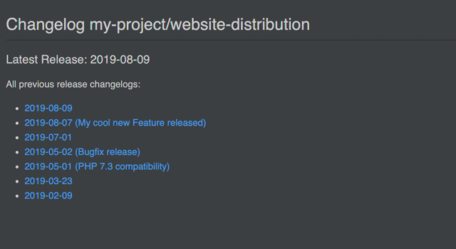
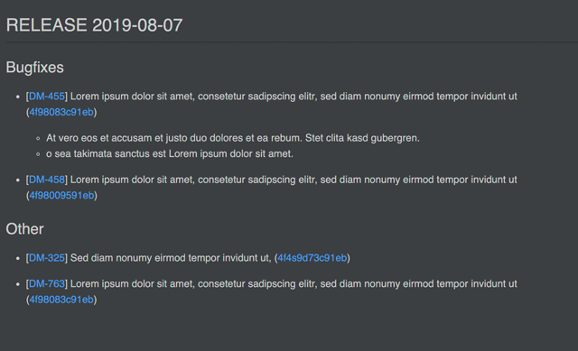

# GIT Changelog Generator
>  composer require --dev dr-bock/git-changelog

Composer package which provides services to generate a changelog for your composer-project from your local git history.

The package is still a beta version. Not all features are fully supported yet. Until the first stable release 
there may be breaking changes. Use at your own risk.

### Disclaimer

I know there are many node- or python-scripts that create a changelog. But I'm a PHP developer and wanted something 
I could really handle. Maybe nobody but me needs this package.

### Installation and Usage...

Add this package to your composer project (ideally as dev-requirement). In the deployed project you certainly don't want to create a changelog.

#### ...as composer command

Add this configuration to your projects composer.json:

```
 "config": {
    "dr-bock/git-changelog": {
      "commitUrl": "https://your.bitbucket.server/projects/your-project/repos/your-repo/commits/%HASH%",
      "issueUrl": "https://your.jira.server/browse/%ISSUE%",
      "changelogIndexFile": "../CHANGELOG.md",
      "changelogFolder": "../Documentation/Changelog/",
      "issueFormat": "jira"
    }
  },
```
Possible options:

|Option|Description|
|---|---|
|commitUrl| Url to a single Commit in your Git-Repository, you can use "%HASH%" and "%SHOT_HASH%" as placeholder for the commit hash. |
|issueUrl| Url to a issue in your helpdesk software. You can use "%ISSUE% as placeholder for the ticket number. |
|changelogIndexFile| Relative path (from your composer projects root) to the changelog overview file. |
|changelogFolder| Relative path (from your composer projects root) to the folder, where to place the detailed changelog files. |
|issueFormat|Format in which issues are tagged in commit message. E.g. "#1234" ("github") or "FOO-12345" ("jira").  Currently only the JIRA format is supported. |


Add this script to your projects composer.json:

```
"scripts": {
    "generate-changelog": [
      "DrBock\\GitChangeLog\\Composer\\GeneratorCommand::generate"
    ]
}
```

A changelog can now be generated with the following command (in the root directory of your composer project):

```
composer git-changelog -- releaseDate=2019-08-01 releaseName="My cool new Feature Relese" fromTag="release-2019-07-01" 
```

Options overview:

|Option|Description||
|---|---|---|
|releaseDate|Date of the release. Format: 2019-08-24|required|
|releaseName|Name of the release|optional|
|fromTag|If a tag is specified, the changelog is only created from the commits created after this git tag (revision). Ideally the tag of the last release should be used here.|optional|
|fromDate|In addition, the selection of commits used to create the changelog can be restricted by a start date. Format: 2019-08-24|optional|
|toDate|In addition, the selection of commits used to create the changelog can be restricted by an end date. Format: 2019-08-24|optional|
|dryRun|If set, no files are written and the result is only displayed in the console.|optional|

#### ...as php library

```
/**
 * Samples for Generation of a markdown changelog
 */
 
$generatorOptions = new GeneratorOptions();
$generatorOptions->setProjectName('My Cool Project')
    ->setOutputFormat(MarkdownOutputAdapter::FORMAT) // 'markdown'
    ->setIssueFormat(IssueFormatHelper::JIRA) // 'jira'
    ->setChangelogIndexFile('CHANGELOG.md')
    ->setChangelogFolder('Documentation/Changelog/')
    ->setIssueUrl('https://your.bitbucket.server/projects/your-project/repos/your-repo/commits/%HASH%')
    ->setCommitUrl('https://your.jira.server/browse/%ISSUE%')
    ->setReleaseDate(new \DateTime('2019-08-24'))
    ->setfromTag('release-2019-07-01')
    ->setReleaseName('My cool release');

$generator = new ChangeLogGenerator($generatorOptions);
$generator->generate();
```

### Screenshots

Example changelog index:



Example changelog details:

